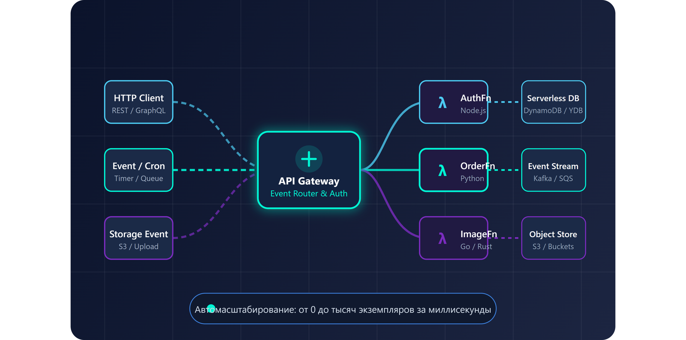
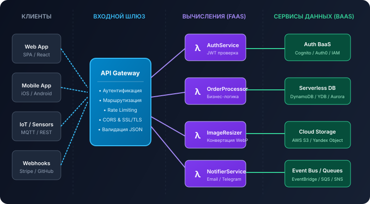

<!DOCTYPE html>
<html lang="ru">
<head>
  <meta charset="UTF-8">
  <meta name="viewport" content="width=device-width, initial-scale=1.0">
  <title>Serverless Hub — разработка без серверов </title>
  <meta name="description" content="Образовательный портал о бессерверной архитектуре (Serverless): принципы работы FaaS, BaaS, архитектура, облачные платформы, безопасность и практические руководства.">
  <meta name="author" content="Ананьин Ефим Вадимович">

  <!-- Шрифты Google Fonts: Inter и JetBrains Mono -->
  <link rel="preconnect" href="https://fonts.googleapis.com">
  <link rel="preconnect" href="https://fonts.gstatic.com" crossorigin>
  <link href="https://fonts.googleapis.com/css2?family=Roboto:ital,wght@0,300;0,400;0,500;0,700;1,300;1,400&family=JetBrains+Mono:wght@400;500;700&display=swap" rel="stylesheet">

  <!-- Favicon: официальная иконка Milligram CSS -->
  <link rel="icon" type="image/svg+xml" href="images/milligram-logo.svg">

  <!-- Нормализация стилей и Milligram CSS (основной CSS-фреймворк № 7) -->
  <link rel="stylesheet" href="https://cdnjs.cloudflare.com/ajax/libs/normalize/8.0.1/normalize.min.css">
  <link rel="stylesheet" href="https://cdnjs.cloudflare.com/ajax/libs/milligram/1.4.1/milligram.min.css">

  <!-- Собственные стили проекта Serverless Hub -->
  <link rel="stylesheet" href="css/style.css">
</head>
<body>

  <!-- ==========================================================================
       Шапка сайта (Site Header)
       ========================================================================== -->
  <header class="site-header">
    

      

        <!-- Логотип и брендинг -->
        <a href="index.html" class="brand-wrapper" aria-label="Serverless Главная">
          
          Serverless
        </a>

        <!-- Основная горизонтальная навигация -->
        <nav class="site-nav" aria-label="Основная навигация">
          <ul>
            <li><a href="index.html" class="nav-link active">Главная</a></li>
            <li><a href="about.html" class="nav-link">О Serverless</a></li>
            <li><a href="architecture.html" class="nav-link">Архитектура</a></li>
            <li><a href="platforms.html" class="nav-link">Платформы</a></li>
            <li><a href="pros-cons.html" class="nav-link">Плюсы и минусы</a></li>
            <li><a href="use-cases.html" class="nav-link">Примеры</a></li>
            <li><a href="tutorial.html" class="nav-link">Практика</a></li>
            <li><a href="security.html" class="nav-link">Безопасность</a></li>
            <li><a href="comparison.html" class="nav-link">Сравнение</a></li>
            <li><a href="glossary.html" class="nav-link">Словарь</a></li>
          </ul>
        </nav>

        <!-- Действия шапки: переключатель темы и бургер-меню -->
                

          <button id="theme-toggle" class="theme-toggle-btn" type="button" title="Переключить тему оформления" aria-label="Переключить тему">
            <svg viewBox="0 0 24 24" width="20" height="20" fill="none" stroke="currentColor" stroke-width="2">
              <path d="M21 12.79A9 9 0 1 1 11.21 3 7 7 0 0 0 21 12.79z"></path>
            </svg>
          </button>
          <button id="burger-btn" class="burger-btn" type="button" title="Открыть меню навигации" aria-label="Открыть мобильное меню">
            <svg viewBox="0 0 24 24" width="22" height="22" fill="none" stroke="currentColor" stroke-width="2" stroke-linecap="round">
              <line x1="3" y1="12" x2="21" y2="12"></line>
              <line x1="3" y1="6" x2="21" y2="6"></line>
              <line x1="3" y1="18" x2="21" y2="18"></line>
            </svg>
          </button>
        

      

    

  </header>

  <!-- Мобильное выпадающее меню (Drawer) -->
  

  <aside id="mobile-nav-drawer" class="mobile-nav-drawer" aria-label="Мобильное меню">
    

      Serverless
      <button id="mobile-nav-close" class="button-clear" type="button" aria-label="Закрыть меню" style="font-size: 2.4rem; padding: 0; height: auto; line-height: 1;">✕</button>
    

    <ul class="mobile-nav-list">
      <li><a href="index.html" class="mobile-nav-link active">Главная страница</a></li>
      <li><a href="about.html" class="mobile-nav-link">Что такое Serverless</a></li>
      <li><a href="architecture.html" class="mobile-nav-link">Архитектура систем</a></li>
      <li><a href="platforms.html" class="mobile-nav-link">Облачные платформы</a></li>
      <li><a href="pros-cons.html" class="mobile-nav-link">Плюсы и минусы</a></li>
      <li><a href="use-cases.html" class="mobile-nav-link">Примеры использования</a></li>
      <li><a href="tutorial.html" class="mobile-nav-link">Практический урок</a></li>
      <li><a href="security.html" class="mobile-nav-link">Безопасность и IAM</a></li>
      <li><a href="comparison.html" class="mobile-nav-link">Сравнение архитектур</a></li>
      <li><a href="glossary.html" class="mobile-nav-link">Словарь и ресурсы</a></li>
    </ul>
  </aside>

  <!-- ==========================================================================
       Hero-секция (Главный баннер)
       ========================================================================== -->
  <section class="hero-section">
    

      

        

          <h1 class="hero-title">
            Serverless —  
            разработка без серверов
          </h1>
          

            Разработка без возни с серверами и сложной инфраструктурой. Пишите код функций, а запуск, железо и масштабирование берёт на себя облако.
          

          

            <a href="about.html" class="button">Начать с основ</a>
            <a href="architecture.html" class="button button-outline">Архитектура →</a>
          

          

            

              0
              серверов для настройки
            

            

              100%
              авто-масштабирование
            

            

              0 ₽
              оплата при простое
            

          

        

        

          <picture>
            <source srcset="images/hero-serverless.webp" type="image/webp">
            
          </picture>
        

      

    

  </section>

  <!-- ==========================================================================
       Основной контент страницы + Сайдбар (Main & Aside)
       ========================================================================== -->
  

    

      <!-- Основной контент (Main) -->
      <main class="column column-75">
        
        <!-- Блок: Краткое объяснение Serverless -->
        <section id="intro" style="margin-bottom: 4rem;">
          <h2>Что такое Serverless?</h2>
          

            Термин <strong>«Serverless» (бессерверные вычисления)</strong> не означает, что серверов физически не существует. Серверы по-прежнему работают в дата-центрах провайдера, однако вся ответственность за их конфигурацию, поддержание работоспособности, сетевую безопасность, балансировку нагрузки и автоматическое масштабирование полностью перенесена на облачного провайдера (Cloud Provider).
          

          

            Разработчик пишет компактные функции (FaaS — Function as a Service), реагирующие на внешние события: HTTP-запросы, появление файла в хранилище, отправку сообщения в очередь или изменение в базе данных. Выполнение функции начинается мгновенно по триггеру и оплачивается строго с точностью до миллисекунд фактического выполнения.
          

        </section>

        <!-- Блок: Ключевые преимущества -->
        <section id="benefits" style="margin-bottom: 4rem;">
          <h2>Почему это удобно: главные плюсы</h2>
          

            

              

                

                  <svg viewBox="0 0 24 24" fill="none" stroke="currentColor" stroke-width="2"><path d="M12 2v20M17 5H9.5a3.5 3.5 0 0 0 0 7h5a3.5 3.5 0 0 1 0 7H6"/></svg>
                

                <h3 class="card-title">Оплата только за работу (Pay-as-you-go)</h3>
                
Вы платите исключительно за те миллисекунды, когда код реально выполнялся. Если сайт не посещают ночью — расходы составляют ровно 0 рублей.

              

            

            

              

                

                  <svg viewBox="0 0 24 24" fill="none" stroke="currentColor" stroke-width="2"><path d="M13 2L3 14h9l-1 8 10-12h-9l1-8z"/></svg>
                

                <h3 class="card-title">Автоматическое масштабирование</h3>
                
При росте нагрузки с 1 до 50 000 параллельных запросов платформа автоматически создаёт нужное количество изолированных микро-экземпляров.

              

            

          

          

            

              

                

                  <svg viewBox="0 0 24 24" fill="none" stroke="currentColor" stroke-width="2"><rect x="2" y="2" width="20" height="8" rx="2" ry="2"></rect><rect x="2" y="14" width="20" height="8" rx="2" ry="2"></rect><line x1="6" y1="6" x2="6.01" y2="6"></line><line x1="6" y1="18" x2="6.01" y2="18"></line></svg>
                

                <h3 class="card-title">Не нужно настраивать серверы</h3>
                
Забудьте про SSH, обновление ядер Linux, настройку NGINX и установку патчей безопасности. Инфраструктура полностью абстрагирована.

              

            

            

              

                

                  <svg viewBox="0 0 24 24" fill="none" stroke="currentColor" stroke-width="2"><circle cx="12" cy="12" r="10"></circle><polyline points="12 6 12 12 16 14"></polyline></svg>
                

                <h3 class="card-title">Быстрый запуск проектов (MVP)</h3>
                
Команды концентрируются на бизнес-логике и создают MVP за дни вместо месяцев, быстро поставляя ценность конечным пользователям.

              

            

          

        </section>

        <!-- Блок: Направления изучения на сайте -->
        <section id="tracks" style="margin-bottom: 4rem;">
          <h2>Разделы справочника</h2>
          
На сайте собрано 10 разделов с понятными объяснениями и примерами:

          
          

            

              

                <h4>1. Теория и истоки</h4>
                
Эволюция от физических серверов и IaaS к бессерверным парадигмам.

                <a href="about.html" class="button button-outline" style="width: 100%;">Читать раздел →</a>
              

            

            

              

                <h4>2. Архитектура</h4>
                
Компоненты FaaS, BaaS, API Gateway, очереди событий и шины данных.

                <a href="architecture.html" class="button button-outline" style="width: 100%;">Схемы систем →</a>
              

            

            

              

                <h4>3. Платформы</h4>
                
AWS Lambda, Azure Functions, Cloudflare Workers и Yandex Cloud.

                <a href="platforms.html" class="button button-outline" style="width: 100%;">Обзор платформ →</a>
              

            

          

          

            

              

                <h4>4. Плюсы и минусы</h4>
                
Честный разбор: холодный старт, вендор-лок и пути решения проблем.

                <a href="pros-cons.html" class="button button-outline" style="width: 100%;">Анализ рисков →</a>
              

            

            

              

                <h4>5. Практика</h4>
                
Пошаговое написание бессерверного микросервиса с симулятором в браузере.

                <a href="tutorial.html" class="button button-outline" style="width: 100%;">Перейти к коду →</a>
              

            

            

              

                <h4>6. Сравнение</h4>
                
Монолит vs Микросервисы vs Serverless — детальная таблица критериев.

                <a href="comparison.html" class="button button-outline" style="width: 100%;">Сравнить решения →</a>
              

            

          

        </section>

        <!-- Блок: Как работает Serverless (4 шага) -->
        <section id="how-it-works" style="margin-bottom: 4rem;">
          <h2>Как работает Serverless-приложение</h2>
          

            

              
1

              <h4>Событие (Event)</h4>
              
Пользователь нажимает кнопку в браузере, отправляя HTTP-запрос, или загружает файл в хранилище.

            

            

              
2

              <h4>Шлюз (API Gateway)</h4>
              
Облачный шлюз валидирует запрос, проверяет авторизационный токен и маршрутизирует вызов.

            

            

              
3

              <h4>Изолированный FaaS</h4>
              
Платформа за миллисекунды запускает MicroVM с кодом функции и передаёт ей полезную нагрузку.

            

            

              
4

              <h4>Результат &amp; Сон</h4>
              
Функция обращается к базе данных BaaS, возвращает ответ клиенту и переходит в режим ожидания.

            

          

        </section>

        <!-- Блок с архитектурной схемой -->
        <section id="diagram-preview" style="margin-bottom: 4rem;">
          <h2>Архитектурная схема взаимодействия</h2>
          
В типовой бессерверной системе компоненты слабо связаны между собой и общаются через события:

          <figure style="margin: 2rem 0;">
            
            <figcaption style="font-size: 1.3rem; color: var(--text-muted); margin-top: 0.8rem; text-align: center;">
              Рис. 1 — Поток взаимодействия компонентов в современной Serverless-архитектуре
            </figcaption>
          </figure>
          

            <a href="architecture.html" class="button">Подробный разбор архитектуры →</a>
          

        </section>

        <!-- Призыв к действию (CTA) -->
        <section class="card" style="background: linear-gradient(135deg, rgba(2, 132, 199, 0.1) 0%, rgba(124, 58, 237, 0.1) 100%); border-color: var(--accent-cyan); text-align: center; padding: 4rem 2rem;">
          <h2>Готовы погрузиться в бессерверный мир?</h2>
          

            Перейдите к фундаментальному разделу «Что такое Serverless», чтобы узнать историю развития технологии, понять устройство модели Pay-as-you-go и познакомиться с ключевыми концепциями.
          

          <a href="about.html" class="button">Перейти к первому уроку</a>
        </section>

      </main>

      <!-- ==========================================================================
           Сайдбар (Aside)
           ========================================================================== -->
      <aside class="column column-25 site-aside">
        
        <!-- Виджет: Содержание раздела -->
        

          <h3 class="widget-title">
            <svg viewBox="0 0 24 24" width="18" height="18" fill="none" stroke="currentColor" stroke-width="2"><path d="M21 15a2 2 0 0 1-2 2H7l-4 4V5a2 2 0 0 1 2-2h14a2 2 0 0 1 2 2z"></path></svg>
            Обратная связь
          </h3>
          
Есть вопрос или отзыв по учебному проекту? Напишите автору:

          <form class="subscribe-form" novalidate>
            <input type="email" placeholder="Ваш email" required aria-label="Email для связи">
            <button type="submit" class="button" style="width: 100%;">Отправить</button>
            

          </form>
        

        <!-- Виджет: Полезные ссылки -->
        

          <h3 class="widget-title">
            <svg viewBox="0 0 24 24" width="18" height="18" fill="none" stroke="currentColor" stroke-width="2"><path d="M10 13a5 5 0 0 0 7.54.54l3-3a5 5 0 0 0-7.07-7.07l-1.72 1.71"></path><path d="M14 11a5 5 0 0 0-7.54-.54l-3 3a5 5 0 0 0 7.07 7.07l1.71-1.71"></path></svg>
            Ресурсы
          </h3>
          <ul class="related-list">
            <li><a href="https://milligram.io/" target="_blank" rel="noopener">Документация Milligram CSS ↗</a></li>
            <li><a href="https://aws.amazon.com/lambda/" target="_blank" rel="noopener">Amazon AWS Lambda ↗</a></li>
            <li><a href="https://azure.microsoft.com/services/functions/" target="_blank" rel="noopener">Microsoft Azure Functions ↗</a></li>
            <li><a href="glossary.html">Словарь терминов Serverless</a></li>
          </ul>
        

      </aside>
    

  

  <!-- Кнопка возврата наверх -->
  <button id="back-to-top" class="back-to-top" type="button" title="Вернуться к началу страницы" aria-label="Наверх">
    <svg viewBox="0 0 24 24" width="22" height="22" fill="none" stroke="currentColor" stroke-width="2.5" stroke-linecap="round" stroke-linejoin="round">
      <line x1="12" y1="19" x2="12" y2="5"></line>
      <polyline points="5 12 12 5 19 12"></polyline>
    </svg>
  </button>

  <!-- ==========================================================================
       Подвал сайта (Site Footer)
       ========================================================================== -->
  <footer class="site-footer">
    

      

        <!-- Колонка 1: О проекте и студенте -->
        

          <h4 class="footer-col-title">Serverless</h4>
          

            Учебный проект по дисциплине «Использование CSS-фреймворков». Разработан с использованием минималистичного CSS-фреймворка <strong>Milligram</strong> и семантического HTML5.
          

          

            <strong>Студент:</strong> Ананьин Ефим Вадимович 
            <strong>Тема № 34:</strong> Бессерверная архитектура (Serverless) 
            
              
              <strong>CSS-фреймворк:</strong> <a href="https://milligram.io" target="_blank" rel="noopener">Milligram.io</a> (v1.4.1)
            
          

        

        <!-- Колонка 2: Навигация -->
        

          <h4 class="footer-col-title">Разделы портала</h4>
          <ul class="footer-links">
            <li><a href="about.html">Что такое Serverless</a></li>
            <li><a href="architecture.html">Архитектура и FaaS/BaaS</a></li>
            <li><a href="platforms.html">Облачные платформы</a></li>
            <li><a href="pros-cons.html">Преимущества и недостатки</a></li>
            <li><a href="use-cases.html">Практические примеры</a></li>
            <li><a href="tutorial.html">Пошаговый урок создания функции</a></li>
          </ul>
        

        <!-- Колонка 3: Дополнительно -->
        

          <h4 class="footer-col-title">Материалы и ссылки</h4>
          <ul class="footer-links">
            <li><a href="security.html">Безопасность и IAM</a></li>
            <li><a href="comparison.html">Сравнение: Монолит vs Serverless</a></li>
            <li><a href="glossary.html">Глоссарий терминов и видео</a></li>
            <li><a href="https://milligram.io/" target="_blank" rel="noopener">Официальный сайт Milligram CSS</a></li>
            <li><a href="README.md" target="_blank">Документация проекта README.md</a></li>
          </ul>
        

      

      

        

          © 2026 Serverless. Образовательный проект. Все права защищены.
        

        

          Разработано на чистом HTML5, CSS3 (Milligram) и JavaScript
        

      

    

  </footer>

  <!-- Скрипты -->
  
</body>
</html>
